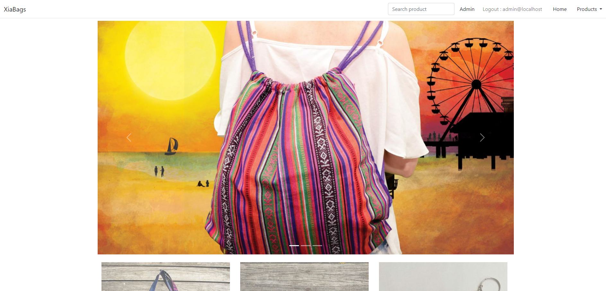

<h2 align='center'>Xia Bags e-commerce</h2>

This project is a functional e-commerce web application developed in HTML, CSS, Bootstrap, C# and .NET MVC. The project features an online store where users can search for and purchase products. Additionally, there is an exclusive administration area for administrators, with panels that allow you to add, edit, and delete products, as well as manage the categories to which products belong. Furthermore, administrators can access comprehensive sales analytics through annual, monthly, and weekly charts.

### Xia Bags Main Page

### Xia Bags all products Page

### Xia Bags Admin Page

### Xia Bags Report Page

### Tools
+ C#
+ ASP .NET Core MVC 
+ Microsoft SQL Server
+ Bootstrap5
+ Html
+ CSS

### References
+ Udemy - Curso de ASP .NET Core MVC - Criando um Site do Zero (NET 6)
